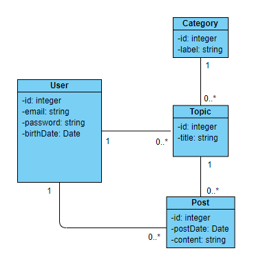

# Exercice Technique CDA

Dans un dépôt Gitlab/Github dont tu nous donneras le lien :
* créer dans le langage souhaité (PHP, JAVA, JS, Python, etc.) les entités correspondant au diagramme ci-dessous ;
* créer un composant d'accès aux données (Repository/DAO) SQL pour l'entité User avec deux (ou plus) des méthodes du CRUD (pas obligatoire de prendre en compte les relations).

